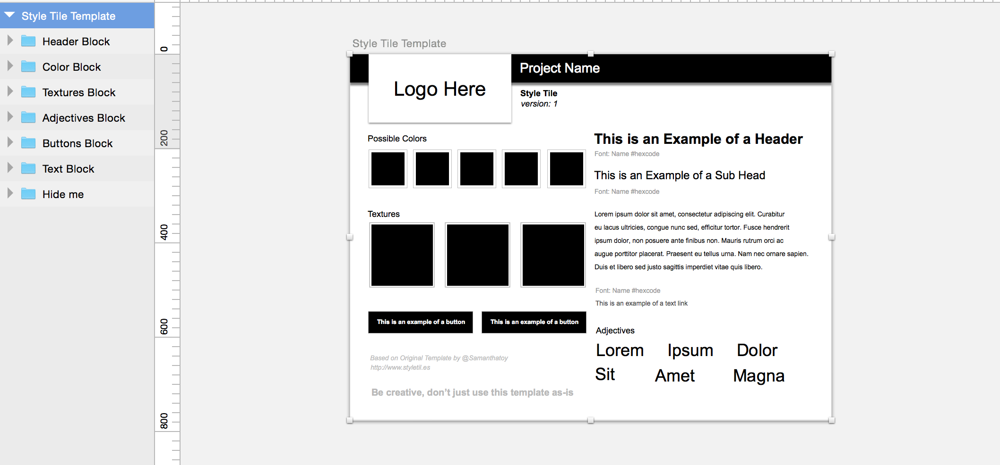

# Sketch Style Tile Basic Template

As I was unable to find a proper basic style tile
and my students [@Thinkful](http://www.thinkful.com) were in need
of a basic Sketch example iso the Adobe Photoshop one.
I hope this helps you as much as it helped my students.

## Screenshot in Sketch 3.3.2

## Get Started
You can Download the Style Tile by clicking on 'Download Zip' right. And
open it by clicking on the `.sketch` file.

## About Style Tiles
The term `Style Tile` was coined by [Samantha Warren](https://twitter.com/samanthatoy).
Here you will find the most basic example of a Style Tile to work with Sketch 3 
and above. [Sketch](http://bohemiancoding.com/sketch/). 
Be sure check out the original website which has a similar Photoshop file on it.
[StyleTil.es](http://styletil.es).

## Contribute
Feel free to use this in any way it might help you design faster.
Also create an issue when you have a question or a PR when you would
like to add something.